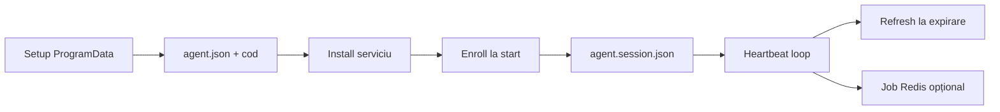

# E2E checklist: printer agent pe Windows (P0)

Verificare manuală după ce backend-ul are migrările aplicate și ai un cod de enrollment valid din manager.

## Precondiții

| Cerință | Detaliu |
|--------|---------|
| PostgreSQL + migrări | Include tabelele printer-agent (`PrinterAgentEnrollmentCodes`, `PrinterAgentRegistrations`, …) și coloanele **refresh** (`RefreshTokenHash`, `RefreshTokenExpiresUtc`) dacă folosiți `api/agents/refresh`. |
| API rulează | `BackendUrl` din `agent.json` trebuie să răspundă (ex. `http://host:7051`). |
| `PrinterAgent` în appsettings | `EnrollmentCodePepper` (sau fallback `UpdateSignatureSecret`) aliniat cu secretul folosit la generarea codurilor. `UpdateSignatureSecret` același ca în `agent.json` pentru update semnat. |
| Redis | **Același server Redis** ca la API, pentru stream-uri `print.jobs.*`. Agentul **nu** folosește Redis pentru enroll; rate limit la enroll e în API (per IP). |
| Drepturi pe disc | Director `%ProgramData%\URSPrinterAgent\` există; serviciul Windows trebuie să poată citi/scrie acolo (vezi `scripts/Setup-ProgramData.ps1`). |

**Cont serviciu:** `Install-UrsPrinterAgent.ps1` creează serviciul cu contul implicit (**Local System**), care are de obicei acces la `ProgramData`. Dacă schimbi contul serviciului, acordă-i **Modify** pe `%ProgramData%\URSPrinterAgent` (și rulează `Setup-ProgramData.ps1` adaptat pentru acel cont).

## Ordinea pașilor



### 1. ProgramData și ACL

Într-o consolă **Administrator**:

```powershell
cd <repo>\Printer-Agent\scripts
.\Setup-ProgramData.ps1 -CopyTemplateFrom "..\PrinterAgent.Worker\agent.json"
```

Editează `%ProgramData%\URSPrinterAgent\agent.json`: `BackendUrl`, secțiunea `Redis` (host, parolă, ACL user dacă e cazul), `Printers` (ID-uri reale sau de test), `EnrollmentCode` = codul din UI (temporar).

Dacă `Connectivity:VerifyAtStartup` este `true`, asigură-te că `BackendUrl` + `Connectivity:BackendHealthPath` (ex. `api/ping-lite`) răspund înainte de start.

### 2. Build și instalare serviciu

**Varianta A — MSI (recomandat pentru câmp)**

1. Din rădăcina repo: `dotnet build PrinterAgent.Installer\PrinterAgent.Installer.wixproj -c Release` (oprește serviciul dacă publish-ul eșuează cu fișier blocat).
2. Rulează `PrinterAgent.Installer\bin\Release\PrinterAgent.msi` cu `cab1.cab` și `cab2.cab` în același folder.
3. În `C:\Program Files\URSPrinterAgent\` (x64: nu căuta în `(x86)`): trebuie să existe `PrinterAgent.Worker.exe`, `PrinterAgent.Configurator.exe` și shortcut **Configure URS Printer Agent** (lângă EXE; **nu** în Meniul Start). Dacă lipsește Configuratorul după un upgrade de la un MSI mai vechi fără acest EXE, **dezinstalează** produsul din Windows, apoi instalează un MSI cu **versiune mai mare** (numărul din `Package.wxs` / titlul instalării).
4. Rulează Configuratorul (ideal ca administrator dacă politicile blochează scrierea în ProgramData), apoi verifică `%ProgramData%\URSPrinterAgent\agent.json` și **repornește** `URSPrinterAgent`.
5. Verificare automată opțională: `.\scripts\Verify-UrsPrinterAgentInstall.ps1 -RepoRoot ".." -ExpectServiceRunning` (ajustează `-RepoRoot`).

**Configurator (după MSI sau dacă rulezi EXE-ul din build):** parcurge wizard-ul (cod enroll, bifă consimțământ scan, scan port 9100, selectează host, nume + `PrinterId`, opțional test print, Salvează). Verifică apoi `agent.json` (EnrollmentCode + `Printers[]`). Rulează `.\scripts\Verify-UrsPrinterAgentInstall.ps1` fără `-Strict` pentru rezumat; cu `-Strict` eșuează dacă lipsește ceva esențial.

**Varianta B — script (dev / manual)**

Publică worker-ul (ex. `dotnet publish -c Release -r win-x64`) și instalează:

```powershell
.\Install-UrsPrinterAgent.ps1 -BinaryPath "C:\cale\către\PrinterAgent.Worker.exe"
```

### 3. După primul start: enroll și sesiune

La pornire, `AgentEnrollmentHostedService` încarcă sesiunea; dacă nu există JWT util, apelează `POST /api/agents/enroll` cu `clientInstanceId` din `%ProgramData%\URSPrinterAgent\client.instance` (creat la nevoie).

Verifică fișierele:

- `client.instance` — GUID pe o linie.
- `agent.session.json` — `agentId`, `restaurantId`, `expiresAtUtc`; pe Windows tokenurile pot fi în `accessTokenProtected` / `refreshTokenProtected`.

Sumar rapid fără a deschide manual JSON:

```powershell
.\scripts\Show-AgentSessionSummary.ps1
```

### 4. Heartbeat

Worker-ul trimite heartbeat la fiecare **~30 s** ([`AgentWorker.cs`](../PrinterAgent.Worker/AgentWorker.cs)). În loguri (consolă dacă rulezi ca app, sau Event Viewer / fișier log dacă e configurat) caută mesaje de succes sau `HeartbeatUnauthorized`.

### 5. Refresh token (P0 recomandat)

Scop: după expirarea JWT-ului de access, agentul **nu** mai are nevoie de `EnrollmentCode` dacă refresh e valid.

1. În **Development** pe API poți seta `PrinterAgent:AgentAccessTokenLifetimeMinutes` la o valoare mică (ex. 5).
2. Lasă serviciul să ruleze **fără** a șterge `EnrollmentCode` până confirmi prima dată enroll + heartbeat.
3. După ce `expiresAtUtc` a trecut (cu marja de 5 minute folosită în cod), în loguri ar trebui să apară reînnoire (ex. „Token de acces reînnoit”).
4. Apoi golește `EnrollmentCode` în `agent.json` (sau șterge cheia), repornește serviciul: heartbeat trebuie să rămână OK.

Dacă înregistrarea din DB e veche și **nu** are refresh populat, re-enroll cu cod nou din manager.

### 6. Fără EnrollmentCode după enroll

1. Șterge valoarea `EnrollmentCode` din `agent.json` sau pune `""`.
2. Repornește `URSPrinterAgent`.
3. Așteptat: serviciul pornește, încarcă sesiunea, heartbeat OK (eventual după refresh dacă access expirase).

### 7. Print din Redis (E2E: stream → agent → imprimantă)

**Aliniere obligatorie**

| Element | Backend (API) | Agent (`%ProgramData%\URSPrinterAgent\agent.json`) |
|--------|----------------|-----------------------------------------------------|
| Redis | Aceeași instanță ca în `ConnectionStrings:Redis` (sau config echivalent) | `Redis:Host`, `Redis:Port`, `Redis:User` / `Redis:Password`, `Redis:Ssl` |
| Stream | `print.jobs.{restaurantId}` (backend: `CreatePrintJobCommandHandler`) | `Redis:StreamKeyPrefix` = `print.jobs` (implicit) |
| `restaurantId` | GUID string în body la `POST /api/print-jobs` | Trebuie să fie **identic** cu `restaurantId` din `agent.session.json` (sau `RestaurantId` din config dacă nu e în sesiune) — vezi [`PrintJobProcessor`](../PrinterAgent.Application/UseCases/PrintJobProcessor.cs). |
| `printerId` | Body la create job | Un `Printers[].Id` existent în `agent.json`. |
| Creare job | `POST /api/print-jobs` cu JWT **manager** (`GlobalAdmin_Or_RestaurantManager`) | — |
| Status job | Agent: `POST /api/print-jobs/{id}/status` cu JWT **agent** | — |

**Exemplu body JSON** (compatibil [`PrintJob`](../PrinterAgent.Domain/PrintJob.cs)):

```json
{
  "restaurantId": "00000000-0000-0000-0000-000000000000",
  "printerId": "kitchen-1",
  "payload": {
    "type": "order",
    "orderId": "e2e-test-1",
    "items": [
      { "name": "Test item", "quantity": 1, "price": 1.00 }
    ]
  }
}
```

Înlocuiește `restaurantId` cu valoarea din `.\scripts\Show-AgentSessionSummary.ps1` și `printerId` cu un `Id` din `Printers`.

**Automatizare:** `.\scripts\Send-TestPrintJob.ps1` (POST + poll status). Variabile utile: `URS_PRINT_BACKEND_URL`, `URS_MANAGER_BEARER`, `URS_PRINT_RESTAURANT_ID`, `URS_PRINT_PRINTER_ID` (sau parametri `-RestaurantId` / `-PrinterId`). Serviciul **URSPrinterAgent** trebuie să ruleze și `printerId` din job să coincidă cu un `Printers[].Id` din `agent.json`. Statusul **Printing** poate dura 1–2 minute cât agentul încearcă TCP spre imprimantă (retry + `PrinterConnectTimeoutSeconds` în `agent.json`).

**Verificare manuală**

1. După create: `GET /api/print-jobs/{jobId}/status` (JWT manager) — status evoluează spre `Success` sau `Failed` (dacă imprimanta TCP nu răspunde, e tot valid pentru lanțul Redis + API).
2. Agent: Event Viewer — mesaje „Received job …” / „acknowledged”.
3. Opțional Redis CLI: `XINFO STREAM print.jobs.{restaurantId}` (fără acolade în cheie — GUID complet).

## Indicii la erori

| Simptom | Unde să te uiți |
|--------|------------------|
| Enroll 401 | Cod invalid/revocat, pepper greșit, ceasuri skew mari. |
| Enroll 429 | Rate limit IP; așteaptă sau ajustează policy în API. |
| Serviciu se oprește imediat | Lipsește `agent.json` în ProgramData, sau lipsesc `AgentId`/`RestaurantId` după enroll (vezi log „Agent oprit”). |
| Heartbeat 401 / sesiune ștearsă | JWT expirat și refresh eșuat sau lipsă; re-enroll sau verifică `api/agents/refresh`. |
| Redis / print | Conexiune, ACL, același `restaurantId` și `print.jobs.{id}`; firewall. |

## Fișiere utile

- Template config: [`PrinterAgent.Worker/agent.json`](../PrinterAgent.Worker/agent.json)
- Sumar sesiune: `scripts/Show-AgentSessionSummary.ps1`
- Verificare instalare / ProgramData: `scripts/Verify-UrsPrinterAgentInstall.ps1`
- Test print E2E (API): `scripts/Send-TestPrintJob.ps1`
- ACL ProgramData: `scripts/Setup-ProgramData.ps1`
- Instalare serviciu: `scripts/Install-UrsPrinterAgent.ps1`
