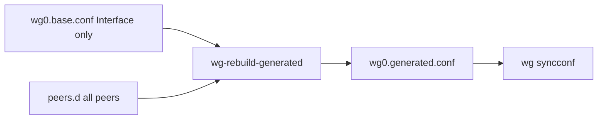

# WireGuard hub production (`10.60.0.1`) — 3-VPS layout

Single configuration model for the **App VPS** WireGuard hub (`universalrestaurant.systems:51820`). Use this with [README.md](README.md) (scripts, `wgctl`, SSH) and backend `QR_Restaurant_backend/deploy/production/ubuntu/REDIS_VPS_PRODUCTION.md` (Redis ACL, agent routing).

## VPN IP map

| VPN IP | Role | Peer file on hub |
|--------|------|------------------|
| `10.60.0.1` | App VPS — API, nginx, **WG hub** | `[Interface]` in `wg0.base.conf` only |
| `10.60.0.2` | Redis VPS | `peers.d/infra-redis-vps.conf` |
| `10.60.0.3` | DB VPS (PostgreSQL) | `peers.d/infra-db-vps.conf` |
| `10.60.0.4+` | Dev/admin clients (optional) | `peers.d/infra-<name>.conf` |
| `10.60.0.10+` | Printer agents | `peers.d/<agentGuid>.conf` (backend) |

Backend agent config: `PrinterAgent:WireGuard:AllowedIps = 10.60.0.2/32` (Redis only through tunnel).

## One system (do not mix models)



| File | Content | Who edits |
|------|---------|-----------|
| `/etc/wireguard/wg0.base.conf` | **Only** `[Interface]` + PostUp/PostDown | Operator / bootstrap |
| `/etc/wireguard/wg0.conf` | Copy of `base` (for `wg-quick@wg0`) | `wg-rebuild-generated` |
| `/etc/wireguard/peers.d/infra-*.conf` | Static VPS / dev peers | Operator / migration |
| `/etc/wireguard/peers.d/<agentId>.conf` | Printer agents | Backend via `wg-peer-upsert` |
| `/etc/wireguard/wg0.generated.conf` | **Generated** — never edit manually | `wg-rebuild-generated` |

**Rule:** no `[Peer]` blocks in `wg0.base.conf`. Legacy hubs that put Redis/DB/dev peers in `base` break `wg-peer-upsert` when `wg syncconf` parses corrupted lines.

### Scripts (install all to `/usr/local/bin/`)

| Script | Purpose |
|--------|---------|
| `wg-rebuild-generated` | Validate `base`, merge `peers.d`, `wg-quick strip` test, sync `wg0.conf` |
| `wg-sync-peers` | Boot PostUp: rebuild + `syncconf` |
| `wg-peer-upsert` / `wg-peer-delete` | Agent peers (called by API over SSH) |
| `wg-migrate-legacy-hub` | One-time: extract `[Peer]` from `base` → `peers.d/infra-*` |

Templates: [wg0.base.production.example.conf](wg0.base.production.example.conf), [peers.d/*.example](peers.d/).

## Bootstrap from scratch

1. Install scripts from this directory (strips CRLF, installs to `/usr/local/bin/`):

```bash
sudo bash install-wireguard-hub-scripts.sh
```

Or copy the folder to the server and run the same command there. From a workstation:

```bash
scp -P 2222 -r docs/wireguard-ssh-provisioning adi@universalrestaurant.systems:/tmp/wg-scripts
ssh -p 2222 adi@universalrestaurant.systems 'cd /tmp/wg-scripts && sudo bash install-wireguard-hub-scripts.sh'
```

2. Create `wg0.base.conf` from [wg0.base.production.example.conf](wg0.base.production.example.conf) (replace `PrivateKey`).

3. Create infrastructure peers (replace public keys from each VPS client):

```bash
sudo mkdir -p /etc/wireguard/peers.d
sudo cp peers.d/infra-redis-vps.conf.example /etc/wireguard/peers.d/infra-redis-vps.conf
sudo cp peers.d/infra-db-vps.conf.example /etc/wireguard/peers.d/infra-db-vps.conf
# edit PublicKey in each file
sudo chmod 600 /etc/wireguard/peers.d/*.conf
```

4. Rebuild and enable WireGuard:

```bash
sudo wg-rebuild-generated wg0
sudo systemctl enable --now wg-quick@wg0
```

5. Complete SSH provisioning for the API (`wgctl`, sudoers, `PROD_WG_SSH_*`) — see [README.md](README.md) sections 3–5.

## Migrate legacy hub (existing production)

If `wg0.base.conf` still contains `[Peer]` blocks (old “all-in-one” hub config):

```bash
cd /path/to/Printer-Agent/docs/wireguard-ssh-provisioning
sudo bash install-wireguard-hub-scripts.sh

sudo wg-migrate-legacy-hub wg0
sudo systemctl restart wg-quick@wg0
sudo systemctl restart qrapi-1 qrapi-2
```

`wg-migrate-legacy-hub`:

- Backs up to `/etc/wireguard/backup-migrate-<timestamp>/`
- Writes each `[Peer]` block to `peers.d/infra-<name>.conf` (uses `# comment` after `[Peer]` for naming, e.g. `# windows-laptop`)
- Fixes `AllowedIPs = x.x.x.x/32[Peer]` typos
- Rewrites `base` to Interface-only
- Runs `wg-rebuild-generated` + `wg-sync-peers`

Idempotent: if `base` already has no `[Peer]`, only rebuilds `generated`.

Restart the printer agent on Windows and confirm `wireguard-conf` returns 200.

## One-time production runbook (after merging script changes)

On **App VPS** (`universalrestaurant.systems`):

```bash
# 1) Copy folder to server, then install (see scp example in Bootstrap section)
sudo bash install-wireguard-hub-scripts.sh

# 2) Migrate if legacy [Peer] in base (safe to run if already clean)
sudo wg-migrate-legacy-hub wg0

# 3) Restart services
sudo systemctl restart wg-quick@wg0
sudo systemctl restart qrapi-1 qrapi-2
```

**Acceptance checks:**

```bash
grep '\[Peer\]' /etc/wireguard/wg0.base.conf          # no output
ls -la /etc/wireguard/peers.d/
sudo wg show wg0                                      # infra + agent peers
sudo journalctl -u qrapi-1 --since "5 min ago" | grep -i 'WireGuard SSH'  # no AllowedIP format errors
```

On the **pilot Windows PC**: restart `URSPrinterAgent` → `WireGuardTunnel$urs-printer-agent` running, `redis.credentials.json` present.

## Troubleshooting

| Symptom | Likely cause | Fix |
|---------|----------------|-----|
| `AllowedIP is not in the correct format: ...[Peer]` | Corrupt line in `base` or `peers.d` | `wg-migrate-legacy-hub` or fix file; never glue `[Peer]` to AllowedIPs |
| `wg-rebuild-generated: base must contain only [Interface]` | `[Peer]` still in `base` | Run migration or move peers to `peers.d/` |
| Agent enroll OK, no tunnel | `wireguard-conf` 400 | API logs `WireGuard SSH`; fix hub scripts/peers |
| Peers missing after reboot | PostUp missing | `PostUp = /usr/local/bin/wg-sync-peers wg0` in `base` |

## Related docs

- [README.md](README.md) — dev `10.8.0.0/24`, `wgctl`, backend flow
- Backend `deploy/production/ubuntu/REDIS_VPS_PRODUCTION.md` — Redis `10.60.0.2`, ACL, agent Redis host
- Backend `deploy/production/ubuntu/PRODUCTION_CI.md` — `PROD_WG_*` GitHub secrets
